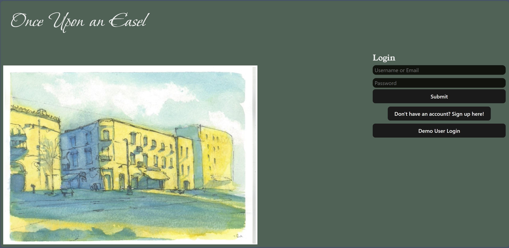
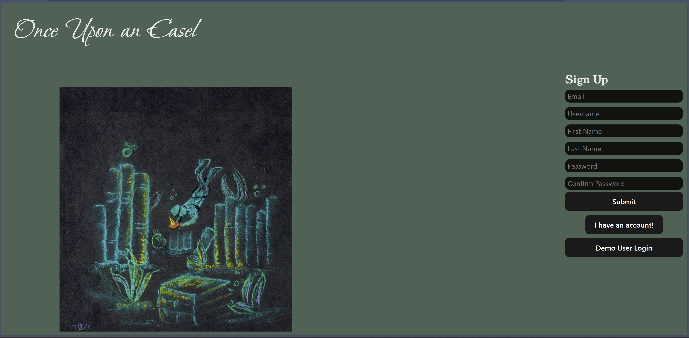
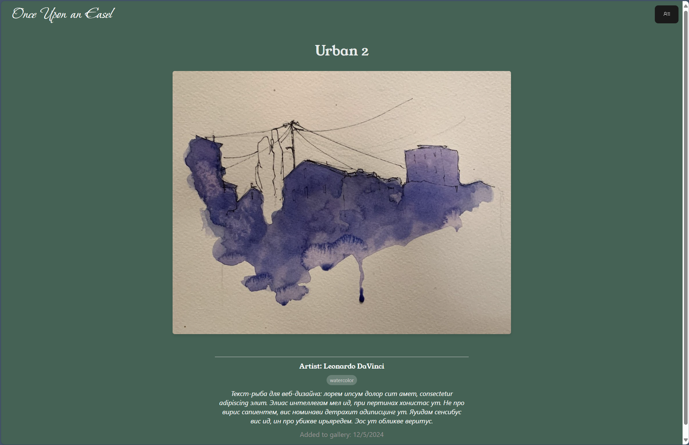
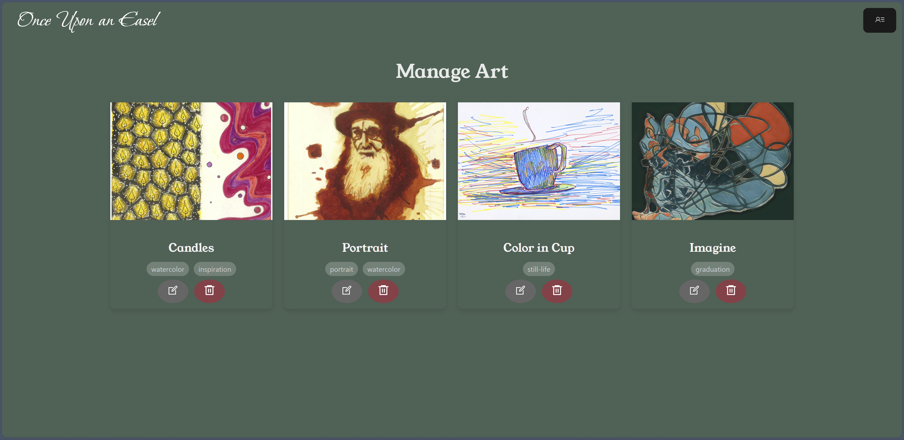
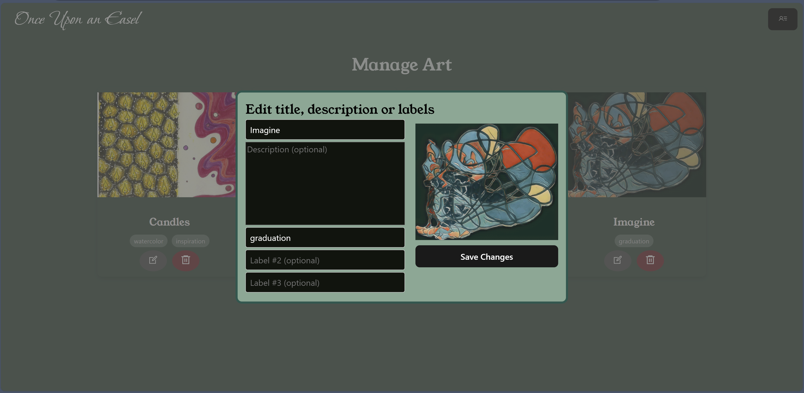

# Once-Upon-an-Easel
Capstone Project

Once Upon an Easel is an art gallery application for users to showcase and manage their creative expression for others.

Live Link: [Once-Upon-an-Easel](https://onceuponaneasel.zevb.dev/)

# Frontend Technologies Used

# Backend Technologies Used

## [Feature List](https://github.com/zev-b/once-upon-an-easel/wiki/Feature-List)
List of application features.

## [Database Schema](https://github.com/zev-b/once-upon-an-easel/wiki/Database-Schema)
A visualization of the relationship between data.

# Splash Page / Log In

# Sign Up

# Gallery Home Page

# Art Details Page

# Manage Art Page

# Upload / Edit Modal

